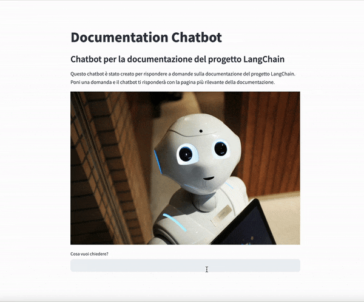

# LangChain and RAG - Talk to your Blog!

## Italiano

Questo progetto è un'applicazione di chatbot che utilizza LangChain, OpenAI e FAISS per generare risposte basate sull'input dell'utente. 

Estrae articoli da un DataFrame, suddivide il testo in frammenti, crea un archivio vettoriale per i frammenti di testo e stabilisce una catena di recupero conversazionale per i messaggi di chat. Il chatbot risponde alle domande degli utenti utilizzando la catena di conversazione implementata. L'obiettivo del progetto è fornire un'esperienza interattiva e coinvolgente con il chatbot per gli utenti.

### Installazione
1. Clona il repository sul tuo computer.
2. Assicurati di avere Python installato e possibilmente Poetry
3. Installa le dipendenze necessarie eseguendo `poetry install`
4. Crea un file `.env` e imposta le variabili d'ambiente necessarie

### Utilizzo
1. Recupera i testi su cui vuoi fare RAG
2. Avvia il frontend con il comando `streamlit run main.py`
3. Il chatbot risponderà alle domande utilizzando la conoscenza estratta dagli articoli

## English

This project is a chatbot application that uses LangChain, OpenAI, and FAISS to generate responses based on user input.

It extracts articles from a DataFrame, splits text into fragments, creates a vector store for text fragments, and establishes a conversational retrieval chain for chat messages. The chatbot answers user questions using the implemented conversation chain. The goal of the project is to provide an interactive and engaging chatbot experience for users.

### Installation
1. Clone the repository on your computer.
2. Make sure you have Python installed and possibly Poetry
3. Install the necessary dependencies by running `poetry install`
4. Create a `.env` file and set the necessary environment variables

### Usage
1. Recover the texts you want to RAG on
2. Start the frontend with the `streamlit run main.py` command
3. The chatbot will answer questions using knowledge extracted from the articles

## References

- https://www.diariodiunanalista.it/posts/chatbot-python-langchain-rag/
- https://medium.com/mlearning-ai/create-a-chatbot-in-python-with-langchain-and-rag-85bfba8c62d2